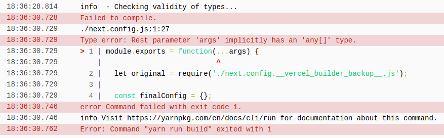

# Vercel issue

When a Next.js project has:

- `next.config.js` (content does not matter)
- `tsconfig.json` with the following settings:
  - `allowJs: true` and `checkJs: true`
  - `strict: true`
  - `"include": ["next-env.d.ts", "**/*.ts", "**/*.tsx", "*.config.js"],`

deployment on Vercel fails with the following error:

